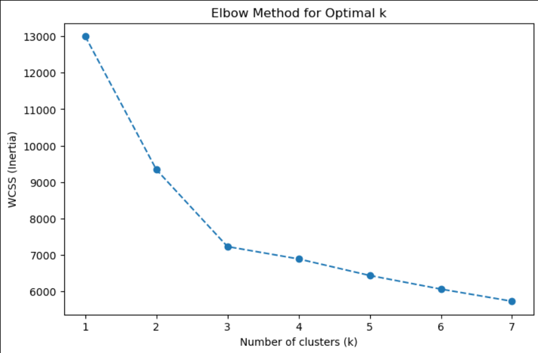
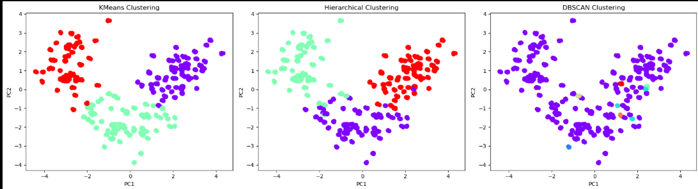

# 📌 Wine Clustering Project

## 🔹 Overview

This project applies **unsupervised machine learning techniques** to the Wine dataset in order to group wines into meaningful clusters based on their chemical properties.
We use **KMeans, Hierarchical Clustering, and DBSCAN**, and evaluate them with clustering metrics like **Silhouette Score, Davies–Bouldin Index, ARI**, and **WCSS (Elbow method)**.

---

## 🔹 Dataset

* **Source**: Wine dataset (178 samples, 13 features).
* **Features** include: Alcohol, Malic Acid, Ash, Ash Alcanity, Magnesium, Total Phenols, Flavanoids, Color Intensity, Hue, Proline, etc.
* Dataset was **expanded to 1000 rows** with synthetic noise for clustering experiments.

---

## 🔹 Steps Performed

1. **Data Preprocessing**

   * Removed duplicates.
   * Handled skewed features (log & power transform).
   * Scaled data using `StandardScaler` (mean=0, std=1).
   * Removed outliers (IQR / DBSCAN noise).

2. **Exploratory Data Analysis**

   * Distribution plots for each feature.
   * Heatmaps for correlation analysis.
   * Outlier detection with boxplots.

3. **Clustering Algorithms**

   * **KMeans** (with Elbow method to select optimal `k`).
   * **Hierarchical (Agglomerative)** clustering with Ward linkage.
   * **DBSCAN** (density-based clustering with noise detection).

4. **Evaluation Metrics**

   * **Silhouette Score** → higher = better cluster separation.
   * **Davies–Bouldin Index** → lower = better compactness & separation.
   * **Adjusted Rand Index (ARI)** → agreement between methods.
   * **WCSS (Within-Cluster Sum of Squares)** → used in Elbow Method.

---

## 🔹 Results (Example)

| Method       | Clusters Found | Silhouette Score | Davies–Bouldin | ARI vs KMeans |
| ------------ | -------------- | ---------------- | -------------- | ------------- |
| KMeans (k=3) | 3              | 0.292            | 1.391          | 1.000         |
| Hierarchical | 3              | 0.287            | 1.391          | 0.882         |

* **KMeans & Hierarchical** → good when we want **exactly 3 clusters**.

---

## 🔹 Key Insights

* **Scaling** is critical, as clustering is distance-based.
* **DBSCAN** performed best in terms of metrics, but it does not allow fixing the number of clusters.
* For datasets with a **known number of groups** (e.g., 3 wine classes), **KMeans or Hierarchical** is more suitable.
* **Outlier removal** improved clustering quality.

---

## 🔹 Visualizations

* Distribution plots with skewness.
* Elbow method (WCSS vs k).
* Silhouette plots.
* PCA scatter plots for cluster visualization.

---

